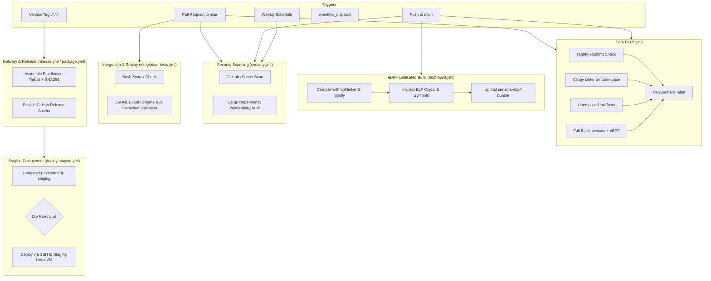

# SecureChain CI/CD Architecture

This document describes the continuous integration, continuous delivery, security scanning, packaging, and deployment pipeline for the **SecureChain** project.

---

## 1. System Overview & Workflow Map

The CI/CD pipeline is designed specifically for the dual-nature architecture of SecureChain:
1. **Userspace Rust Crates (`sensors`, `sensors-common`)**: Standard Linux/multiplatform Rust binaries and libraries.
2. **In-Kernel eBPF Sensors (`sensors-ebpf`)**: Rust Aya kernel probes compiled targeting Linux eBPF using `bpf-linker` and Rust nightly `rust-src`.

---

## 2. Workflows Implemented

| Workflow File | Triggers | Key Responsibilities |
| --- | --- | --- |
| [`.github/workflows/ci.yml`](file:///.github/workflows/ci.yml) | `push`, `pull_request` (to `main`), `workflow_dispatch` | Formatting (Nightly `rustfmt`), Clippy, userspace unit tests, release build of sensor binary + eBPF payload, and consolidated status summary. |
| [`.github/workflows/ebpf-build.yml`](file:///.github/workflows/ebpf-build.yml) | `push`/`pull_request` (on eBPF paths), `workflow_dispatch` | Dedicated compilation of eBPF programs, ELF header/symbol inspection, and raw bytecode artifact upload. |
| [`.github/workflows/security.yml`](file:///.github/workflows/security.yml) | `push`, `pull_request`, weekly cron, `workflow_dispatch` | Secret leakage scanning via `Gitleaks` and Rust vulnerability audit via `cargo-audit`. |
| [`.github/workflows/integration-tests.yml`](file:///.github/workflows/integration-tests.yml) | `push`, `pull_request`, `workflow_dispatch` | Validates demo automation shell scripts and verifies JSONL event schemas and jq attack chain extraction pipelines. |
| [`.github/workflows/package.yml`](file:///.github/workflows/package.yml) | `workflow_dispatch`, reusable workflow call | Assembles distribution tarballs (`securechain-sensors-linux-x86_64.tar.gz`) along with documentation, licenses, and SHA256 checksums. |
| [`.github/workflows/release.yml`](file:///.github/workflows/release.yml) | `push` of tags `v*.*.*` | Validates semver tags, compiles release artifacts, packages distribution tarballs with SHA256 sums, and publishes a GitHub Release. |
| [`.github/workflows/deploy-staging.yml`](file:///.github/workflows/deploy-staging.yml) | `workflow_dispatch` | Controlled staging deployment targeting Linux VMs using GitHub Environment protection rules with dry-run safety gates. |

---

## 3. Security Boundary & Permissions

- **Minimal Permissions**: All workflows enforce `permissions: contents: read` globally, except `release.yml` which explicitly requires `permissions: contents: write` to publish release releases.
- **Pull Request Isolation**: Deployment secrets and elevated environments are restricted to protected branches and environments (`staging`). Untrusted pull requests cannot access credentials.
- **Concurrency Controls**: Active pull request runs automatically cancel preceding runs to save CI runner minutes (`concurrency.cancel-in-progress: true`).
